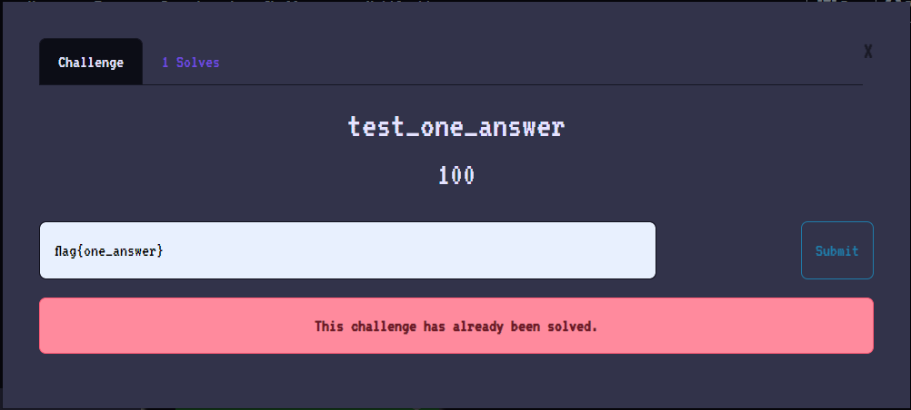

# One Answer Challenge | a plugin for CTFd

This plugin will give a new type of challenges named `one_answer_challenge`. Users could create this type of challenge to limit the number of times this challenge can correctly submit a flag. Once a correct flag is submitted, the challenge will not allow anyone else to submit it.

# Installation

**REQUIRES: CTFd >= v3.4.0**

1. Clone this repository to `your_CTFd_path/CTFd/plugins` or download the source to that.
2. Restart your service of CTFd.